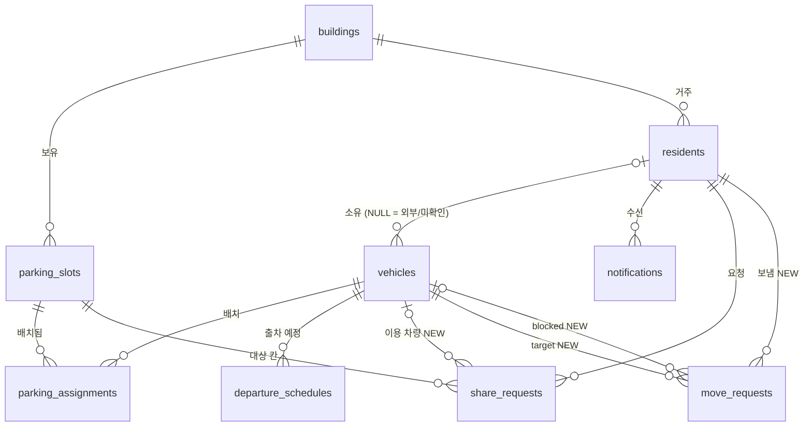

# DB 설계 문제점 · 백엔드 구현 참고서

> **2026-09-30 반영 현황** — 마이그레이션 `0002_init_domain_schema` 로 스키마 생성 완료.
> 와이어프레임(Manyfast/Figma) 대조 후 합의:
> - 칸 = **운영팀이 미리 등록한 구역(`parking_zones`) + 구역 안 번호**(`parking_slots.number`), 2.5D 로컬 좌표(`render_x0..y1`)와 앞 칸(`front_slot_id`)을 칸에 저장. 관리자는 칸의 사용/공유 여부만 변경. 칸 유형은 `is_shareable` 만.
> - 공유 차고지는 **시간제만** (`garages`, 칸은 `parking_slots.garage_id`).
> - 반복 출차는 **요일 + 출차 시간만** (기존 `repeat_weekdays` 유지, 귀차·종료 조건 없음).
> - 가입은 **이메일 + 초대코드** (`residents.email/password_hash/nickname`, `buildings.invite_code`).
> - 1-1 ~ 1-3, 2-1, 2-4, 2-6, 2-7, 2-8, 4-2(앞 칸), 4-3(알림 원인 FK) 은 반영됨. `vehicles.is_resident_vehicle` 은 제거(2-2, 조회 시 계산).
> - 남은 것: 1-4 건물 경계 앱 검증, 2-3 출차 우선순위 조회 규칙, 3-x 삭제 정책(현행 유지), 4-4 좌표 기준(로컬 미터로 가정), 4-5 인증 구현.

> 기준: `app/models/*.py` (2026-09-30) + 2026-09-29 와이어프레임 개편 때 합의한 변경분(**NEW**).
> 현재 마이그레이션은 `0001_enable_postgis.py`뿐이라 **실제 테이블은 아직 생성된 적이 없다.** 아래 제약은 첫 스키마 마이그레이션에 함께 넣는 것이 가장 싸다.

범례: 🔴 데이터가 꼬임 · 🟠 의미가 모호함 · 🟡 삭제/이력 부작용 · ⚪ 아직 모델에 없음 · ❓ 결정 필요

---

## 0. 전체 구조 요약



- 건물(`buildings`)이 뿌리, 운영 데이터(배치·출차·공유·이동 요청)는 **차량(`vehicles`)** 에 매달린다.
- 차량은 건물에 직접 속하지 않는다 → 소속 건물은 `vehicles.owner_id → residents.building_id` 로만 알 수 있다.
- 관리자는 `residents.role = manager`, 권한 범위는 그 사람의 `building_id`.
- DB가 강제하는 것: PK·FK·NOT NULL, `vehicles.plate_no` UNIQUE, enum 값, 문자열 길이, PostGIS 타입. **나머지 업무 규칙은 전부 앱이 지켜야 한다.**

### 합의된 변경분 (NEW, 아직 코드 미반영)

| 대상 | 변경 | 이유 |
|---|---|---|
| `parking_assignments.is_permanent` | bool, default false | n15 "상시 주차 여부" 토글 |
| `departure_schedules.memo` | text, nullable | n15/n18 "메모 (선택)" |
| `share_requests.vehicle_id` | FK vehicles, nullable | 공유로 들어온 외부 차가 어떤 번호판인지 연결 |
| `move_requests` (신규) | requester_id, target_vehicle_id, blocked_vehicle_id(nullable), needed_by, reason, status(pending/moved/declined), created_at, responded_at | 입주민·관리자 이동 요청 통합. **수신자 = target_vehicle.owner_id** (저장하지 않음) |
| `notification_type` | `move_request`, `move_response` 추가 | 이동 요청 알림 |

외부 차량 규칙: 공유 이용자 차량(owner 있음)은 앱으로 이동 요청 / owner 없는 "미확인 차량"은 관리자가 번호판만 등록, 이동 요청 불가("앱으로 연락 불가").

---

## 1. 🔴 데이터가 꼬이는 문제 — 제약으로 막을 것

### 1-1. 한 칸에 차 두 대 / 한 차가 두 칸에 동시 주차 가능
`parking_assignments` 에 같은 `slot_id`(또는 `vehicle_id`)로 `is_active = true` 행이 여러 개 들어갈 수 있다.

```python
# parking_assignment.py  __table_args__
Index("uq_active_slot", "slot_id", unique=True, postgresql_where=text("is_active")),
Index("uq_active_vehicle", "vehicle_id", unique=True, postgresql_where=text("is_active")),
```
- 앱 로직: 새 배치 시 같은 트랜잭션에서 기존 활성 배치를 `is_active=false, released_at=now()` 로 닫고 INSERT. 제약 위반(`IntegrityError`)은 409로 변환.

### 1-2. 공유 시간대 겹침 · 역전된 시간
같은 칸·같은 날짜에 `accepted` 요청이 겹쳐도 막지 못하고, `start_time >= end_time` 도 허용된다.

```sql
ALTER TABLE share_requests ADD CONSTRAINT ck_share_time CHECK (start_time < end_time);
-- btree_gist 필요
CREATE EXTENSION IF NOT EXISTS btree_gist;
ALTER TABLE share_requests ADD CONSTRAINT ex_share_overlap
  EXCLUDE USING gist (
    slot_id WITH =,
    tsrange(request_date + start_time, request_date + end_time) WITH &&
  ) WHERE (status = 'accepted');
```
- 수락 API(`POST /share-requests/{id}/decision`)에서 위반 시 409 "이미 수락된 시간과 겹침".

### 1-3. 칸 코드 중복
한 건물 안에 `B1` 이 두 개 생길 수 있다.
```python
UniqueConstraint("building_id", "code", name="uq_slot_code_per_building")
```

### 1-4. 건물 경계 무시 (앱에서 검증)
FK만으로는 표현이 어려워 **앱 검증**으로 막는다.
- 배치: 입주민 차량은 **자기 건물의 칸**에만 배치 (`slot.building_id == vehicle.owner.building_id`). 외부 차량은 해당 칸에 `accepted` 공유 요청이 있을 때만.
- 공유 요청: 대상 칸이 `zone_type = alley_share` **그리고** `is_shareable = true` 이고, 요청자가 **다른 건물** 주민일 것.
- 관리자 행위: 관리자의 `building_id == slot.building_id` 일 때만 수락/거절·미확인 차량 등록 가능.

---

## 2. 🟠 의미가 모호한 문제 — 규칙을 정해 코드에 고정

| # | 문제 | 권장 규칙 |
|---|---|---|
| 2-1 | `parking_assignments.is_active` 와 `released_at` 이 모순 가능 | `CHECK (is_active = (released_at IS NULL))` 추가, 또는 `is_active` 를 없애고 `released_at IS NULL` 로 판단 |
| 2-2 | `vehicles.is_resident_vehicle` 이 owner의 건물과 어긋날 수 있음 | 저장하지 말고 "조회 시점의 건물 기준"으로 계산 권장 (차량은 건물에 직접 속하지 않으므로 건물마다 답이 다름) |
| 2-3 | `departure_schedules` 가 배치 건이 아닌 **차량**에 붙음 → 같은 날 여러 행, 등록값과 AI 추정값 공존 | 조회 규칙: (차량, 날짜)별로 **사용자 등록 > AI 추정**, 같은 종류면 최신 `created_at`. 또는 `UNIQUE(vehicle_id, scheduled_date, is_ai_estimated)` |
| 2-4 | `repeat_weekdays` 에 0–6 외 값 허용, 한 행에 "특정 날짜"와 "반복 요일" 혼재 | `CHECK (repeat_weekdays <@ ARRAY[0,1,2,3,4,5,6])`. 반복 행은 `scheduled_date` = 반복 시작일로 해석한다고 명시 ❓(아래 4-1) |
| 2-5 | 출차·공유는 시간대 없는 `date + time`, 나머지는 `timestamptz` | 서버는 **Asia/Seoul 기준**으로 해석한다고 고정. 자정 넘는 공유(22~02시)는 현재 표현 불가 → 필요 시 `start_at/end_at timestamptz` 로 변경 |
| 2-6 | `share_requests` 결정 API가 `status=pending` 으로의 "결정"도 받음 | 스키마에서 `accepted | rejected` 만 허용 |
| 2-7 | `move_requests` target = blocked 같은 차 가능 (NEW) | `CHECK (target_vehicle_id <> blocked_vehicle_id)`; target의 owner가 NULL이면 생성 거부(미확인 차량) |
| 2-8 | `manner_temperature` 범위 없음 | `CHECK (manner_temperature BETWEEN 0 AND 99.9)` 정도 |

---

## 3. 🟡 삭제·이력 부작용

| # | 상황 | 현재 결과 | 권장 |
|---|---|---|---|
| 3-1 | 주민 삭제 | `vehicles.owner_id` SET NULL → 그 차가 **조용히 "미확인 차량"이 됨**, 활성 배치도 남음 | 주민 삭제 = 소프트 삭제(`deleted_at`) 또는 삭제 시 활성 배치 종료 + 차량도 삭제 ❓ |
| 3-2 | 주민/칸 삭제 | `share_requests`, `notifications` CASCADE 삭제 → 공유 이력·통계 소실 | 이력성 테이블은 `RESTRICT` 또는 소프트 삭제 |
| 3-3 | 건물 삭제 | 칸·주민 CASCADE, 차량은 owner NULL로 남아 어느 건물에도 안 속한 고아 차량 발생 | 건물 삭제는 운영상 막거나(관리자 기능 없음) 소프트 삭제 |
| 3-4 | 칸 삭제 | 배치 이력 CASCADE → 관리자 **혼잡도 차트 데이터 소실** | 칸은 삭제 대신 `is_active=false` 만 사용 (이미 컬럼 있음) |

---

## 4. ⚪ 모델에 아직 없는 것 / ❓ 결정이 필요한 것

### 4-1. ❓ 출차 예정을 배치 건에 묶을지
- A안(현재): 차량에 붙임. 배치를 바꿔도 출차 시간 유지. 막힘 계산 시 "지금 활성 배치 + 해당 날짜 출차 예정"을 조인.
- B안: `departure_schedules.assignment_id` 추가. 한 주차 건 = 한 출차 예정으로 명확. 반복 일정은 별도 테이블(`departure_rules`)로 분리.

### 4-2. ⚪❓ 막힘 판정용 칸 앞뒤 관계 (핵심 기능 전제)
추천 자리, "막힘" 표시, 전날 밤 알림(기획 2·3·4)은 **"어느 칸이 어느 칸을 막는가"** 없이는 계산 불가.
- 후보: `parking_slots.blocks_slot_id` (FK self, 바로 뒤 칸) 또는 `slot_blocks(front_slot_id, back_slot_id)` 조인 테이블(한 칸이 여러 칸을 막는 경우).
- 판정: `front` 차의 출차 예정 > `back` 차의 출차 예정 이면 back이 막힘.

### 4-3. ⚪ 알림 ↔ 원인 연결
`notifications` 에 원인 FK가 없어 알림 탭 → 해당 요청 화면 이동이 불가.
- 권장: `share_request_id`, `move_request_id` nullable FK 추가 (또는 `ref_type` + `ref_id`).

### 4-4. ⚪ 좌표계
2.5D 배치도는 건물 로컬 좌표, `parking_slots.geom` 은 SRID 4326(위경도).
- 렌더링용 로컬 좌표(`x, y, w, h` 또는 SRID 0 폴리곤)를 별도 컬럼으로 둘지 결정 필요.

### 4-5. ⚪ 인증/권한
현재 API에 인증이 없음. 모든 "누가 요청하는가" 검증(1-4, 2-7)의 전제.

---

## 5. 백엔드 로직 체크리스트

**차 배치 + 출차 등록 (n15, 한 번의 저장)**
- [ ] 한 트랜잭션: 기존 활성 배치 종료 → 새 배치 INSERT → 출차 예정 INSERT/UPSERT
- [ ] 칸이 활성(`is_active`)·같은 건물·비어 있음 확인, 아니면 "사용 불가"(n25)용 에러 코드
- [ ] `is_permanent = true` 면 출차 예정 생략 허용
- [ ] `repeat_weekdays` 0–6 검증

**출차 일정 수정 (n18)**
- [ ] 배치는 건드리지 않고 출차 예정만 갱신, 사용자 등록 시 같은 날 AI 추정값 무시/삭제

**공유 요청**
- [ ] 생성: 칸 `alley_share` + `is_shareable`, 요청자 타 건물, `start < end`, `vehicle_id` 는 요청자 소유
- [ ] 결정: 관리자 건물 일치, `pending` 에서만, 겹침 시 409, 결과 알림(`share_response`) 생성

**이동 요청 (NEW)**
- [ ] target 차량 owner 없으면 거부("앱으로 연락 불가")
- [ ] 수신자 = `target.owner_id` 로 알림(`move_request`) 생성, 응답 시 요청자에게 `move_response`
- [ ] 같은 target에 `pending` 중복 요청 방지(부분 UNIQUE 또는 앱 검사)

**관리자 화면 (n41)**
- [ ] 실시간 현황 = 활성 배치 + 수락된 공유 + 미확인 차량
- [ ] 혼잡도 = 날짜별 최대 동시 활성 배치 수 (`assigned_at`~`released_at` 구간 겹침) → 칸 삭제 금지(3-4) 전제

---

## 6. 첫 마이그레이션에 넣을 것 (요약)

1. 부분 UNIQUE: 활성 배치 칸/차량 (1-1)
2. `ck_share_time`, `ex_share_overlap` + `btree_gist` (1-2)
3. `uq_slot_code_per_building` (1-3)
4. `is_active ↔ released_at` CHECK (2-1), `repeat_weekdays` CHECK (2-4)
5. NEW 컬럼/테이블/enum 값 (0장 표)

결정 후 반영: 4-1 출차-배치 연결, 4-2 칸 앞뒤 관계, 3-1 주민 삭제 정책, 4-3 알림 원인 FK, 4-4 로컬 좌표.
