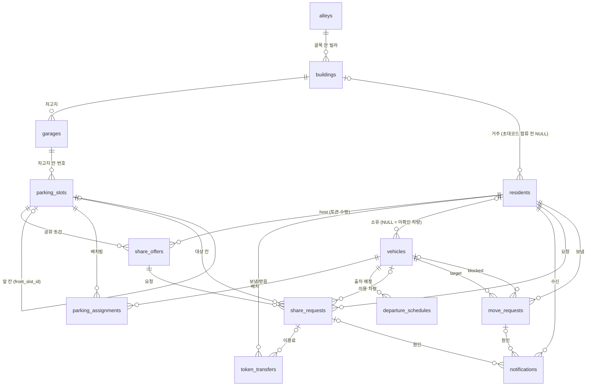

# DB 설계 현황 · 백엔드 구현 참고서

> 기준: `app/models/*.py` + 마이그레이션 `0002_init_domain_schema` (2026-09-30), `0003_alley_garage_share_offer_token` (2026-10-01, Manyfast 기획 충돌 정리).
> 스키마는 와이어프레임(Manyfast/Figma) 대조 후 합의한 내용으로 생성 완료. CI 의 `alembic check` 로 모델 ↔ 마이그레이션 일치를 검사한다.

범례: ✅ 반영됨 · 🔴 데이터가 꼬임 · 🟠 규칙 필요 · 🟡 삭제/이력 부작용 · ⚪ 미구현 · ❓ 결정 필요

---

## 0. 전체 구조

합의 사항
- **계층**: 골목(`alleys`) > 빌라(`buildings`) > 차고지(`garages`) > 칸(`parking_slots`). 0003 에서 구역(`parking_zones`)을 차고지로 바꿨다. 차고지 종류 `ROADSIDE` = 골목 노상 (기존 `ALLEY`).
- **칸** = 운영팀이 미리 등록한 차고지 + 차고지 안 번호(`parking_slots.number`). 2.5D 로컬 좌표(`render_x0..y1`)와 앞 칸(`front_slot_id`)을 칸에 저장. 관리자는 칸의 사용(`is_active`) 여부를 바꾸고 공유 조건을 연다.
- **공유 조건**은 칸별 `share_offers` 하나로 통일: 기간(`start_date`~`end_date`, 포함) · 요일 · 정시 단위 시간(`start_hour`~`end_hour`, 0~24) · 시간당 토큰 · 최대 이용 시간 · 공개 여부(`is_public = false` = 공유 중단). 칸 하나에 기간별로 여러 개 가능.
- **공유 요청**은 정시 단위(`request_date` + `start_hour`~`end_hour`). 요청 시 `total_price = 시간 수 × hourly_price` 를 고정.
- **결제는 토큰만**: `residents.token_balance` + `token_transfers`. 수락 시 요청자 → `share_offers.host_id` 로 이동. 보낸 사람 NULL = 시스템 지급.
- **반복 출차**는 요일 + 출차 시간만 (`repeat_weekdays`, 귀차·종료 조건 없음). 반복 행의 `scheduled_date` = 반복 시작일.
- **가입**은 이메일 + 초대코드 (`residents.email/password_hash/nickname`, `buildings.invite_code`).
- **차량 소속**은 저장하지 않는다. 입주민/외부 구분은 조회하는 건물 기준으로 `vehicle.owner.building_id` 를 비교해 계산.
- **미확인 차량**(owner NULL)은 관리자가 번호판만 등록, 이동 요청 불가("앱으로 연락 불가").
- **이동 요청 수신자** = `target_vehicle.owner_id` (저장하지 않음).
- 관리자는 `residents.role = MANAGER`, 권한 범위는 그 사람의 `building_id`.

---

## 1. ✅ DB 제약으로 반영된 것

| 대상 | 제약 | 막는 문제 |
|---|---|---|
| `parking_assignments` | `uq_active_assignment_slot`, `uq_active_assignment_vehicle` (부분 UNIQUE, `is_active`) | 한 칸에 두 대 / 한 차가 두 칸 |
| `parking_assignments` | `ck_assignment_active_released`: `is_active = (released_at IS NULL)` | 상태 모순 |
| `share_requests` | `ck_share_request_hours`: `0 <= start_hour < end_hour <= 24`, `ck_share_request_price` | 역전된 시간, 음수 가격 |
| `share_requests` | `fk_share_request_offer_slot`: `(offer_id, slot_id)` → `share_offers(id, slot_id)` | 요청 칸과 공유 조건 칸 불일치 |
| `share_requests` | `ex_share_accepted_overlap` (EXCLUDE gist, `status = 'ACCEPTED'`, btree_gist) | 같은 칸 수락 시간 겹침 |
| `parking_slots` | `uq_slot_number_per_garage`, `ck_slot_number_positive`, `ck_slot_front_not_self` | 칸 번호 중복, 자기 자신을 앞 칸으로 |
| `garages` | `uq_garage_name_per_building` | 차고지 이름 중복 |
| `departure_schedules` | `ck_departure_weekdays`: `repeat_weekdays <@ ARRAY[0..6]` | 잘못된 요일 |
| `share_offers` | 기간 순서, 시간 범위(0~24, 시작 < 종료), 요일 범위, `hourly_price >= 0`, `max_hours > 0` | 잘못된 공유 조건 |
| `token_transfers` | `amount > 0`, 보낸 사람 ≠ 받는 사람 | 0/음수 이동, 자기 자신에게 이동 |
| `move_requests` | `ck_move_request_distinct_vehicles`, `uq_pending_move_request_target` (부분 UNIQUE) | target = blocked, 같은 차 대기 요청 중복 |
| `residents` | `email` UNIQUE, `ck_resident_manner_temperature` (0–99.9) | 중복 가입, 매너 온도 범위 |
| `vehicles` | `plate_no` UNIQUE, `uq_primary_vehicle_per_owner` | 번호판 중복, 대표 차량 둘 |
| `buildings` | `invite_code` UNIQUE | 초대코드 충돌 |
| `notifications` | `share_request_id`, `move_request_id` FK | 알림 탭 → 원인 화면 이동 |

> ✅ 제약 위반(`IntegrityError`)은 전역 핸들러가 409 로 변환한다 (`app/core/db_errors.py`). 명세의 에러 형식 `{"error": {code, message, detail}}` 으로 바꾸는 작업은 이슈 #4.

Enum 값은 DB 에 **대문자 이름**(`PENDING`, `ACCEPTED`, …)으로 저장된다. raw SQL·부분 인덱스 조건에서 소문자를 쓰지 않도록 주의.

---

## 2. 🔴🟠 앱이 지켜야 할 규칙 (DB 로 강제 안 됨)

### 2-1. 건물 경계
- 배치: 입주민 차량은 **자기 건물 칸**에만 (`slot.garage.building_id == vehicle.owner.building_id`). 외부 차량은 그 칸·시간에 `ACCEPTED` 공유 요청이 있을 때만.
- 공유 요청: 공개된 `share_offers` 의 기간·요일·시간·최대 시간 안 (구현됨), 요청자 ≠ host (구현됨), 요청자는 **다른 건물** 주민, `vehicle_id` 는 요청자 소유. **같은 골목**의 다른 빌라만 (명세 `GET /garages`)
- 관리자 행위: 관리자 `building_id == slot.garage.building_id` 일 때만 수락/거절·미확인 차량 등록.

### 2-2. 출차 예정 조회 규칙
같은 (차량, 날짜)에 여러 행이 있으면 **사용자 등록 > AI 추정**, 같은 종류면 최신 `created_at`. 반복 행은 `scheduled_date` 이후 `repeat_weekdays` 요일마다 적용.

### 2-3. 시간대
출차는 시간대 없는 `date + time`, 공유는 `date + 정시(0~24)`, 나머지는 `timestamptz`. 서버는 **Asia/Seoul** 기준으로 해석. 자정을 넘는 공유(22~02시)는 현재 표현 불가 → 이틀로 나눠 요청하거나, 필요해지면 `start_at/end_at timestamptz` 로 변경.

### 2-4. 이동 요청
target 차량의 owner 가 NULL 이면 생성 거부.

---

## 3. 🟡 삭제·이력 정책 (현행 유지, 운영상 삭제 API 를 만들지 않음)

| 상황 | 현재 FK 동작 | 권장 |
|---|---|---|
| 주민 삭제 | `vehicles.owner_id` SET NULL → 차가 조용히 미확인 차량이 됨, 공유/이동 요청·알림 CASCADE | 소프트 삭제 또는 삭제 시 활성 배치 종료 ❓ |
| 골목·건물 삭제 | 빌라·차고지·칸 CASCADE, 주민 `building_id` SET NULL | 삭제 API 제공 안 함 |
| 칸 삭제 | 배치 이력 CASCADE → 혼잡도 데이터 소실 | 삭제 대신 `is_active = false` |
| 차고지 삭제 | 칸·공유 조건·공유 요청 CASCADE (`token_transfers.share_request_id` 는 SET NULL 로 기록 유지) | 삭제 대신 칸 `is_active = false` |

---

## 4. ⚪❓ 남은 과제

| # | 항목 | 상태 |
|---|---|---|
| 4-1 | **인증/권한** — 이메일 가입·로그인, 초대코드 합류, 토큰 → 현재 사용자 의존성 | ⚪ 모든 "누가 요청하는가" 검증의 전제 |
| 4-2 | 출차 예정을 배치 건에 묶을지 (현재: 차량에 붙임, 배치를 바꿔도 유지) | ❓ 현행 유지 |
| 4-3 | 2.5D 좌표 기준 | ❓ 건물 로컬 미터로 가정. `buildings.location` 만 위경도(4326) |
| 4-4 | 한 칸이 여러 칸을 막는 배치 | ❓ 현재 `front_slot_id` 하나. 필요 시 `slot_blocks` 조인 테이블 |
| 4-5 | 주민 삭제 정책 (3장) | ❓ |

---

## 5. 백엔드 로직 체크리스트

**공통**
- [x] `IntegrityError` → 409 변환 (제약 이름별 메시지)
- [ ] API 테스트 (현재는 health · 매퍼 테스트뿐)

**인증 (4-1)**
- [ ] 회원가입(email, password, nickname) / 로그인 / 초대코드로 `building_id` 설정
- [ ] 관리자 권한 의존성 (`role = MANAGER` + 건물 일치)

**차 배치 + 출차 등록 (n15, 한 번의 저장)**
- [ ] 한 트랜잭션: 기존 활성 배치 종료(`is_active=false, released_at=now()`) → 새 배치 INSERT → 출차 예정 INSERT
- [ ] 칸이 활성·같은 건물·비어 있음 확인, 아니면 "사용 불가"(n25) 에러 코드
- [ ] `is_permanent = true` 면 출차 예정 생략 허용

**출차 일정 수정 (n18)**
- [ ] 배치는 두고 출차 예정만 갱신, 사용자 등록 시 같은 날 AI 추정값 무시

**막힘 판정 · 추천**
- [ ] 앞 칸(`front_slot_id`) 차의 출차 예정 > 이 칸 차의 출차 예정이면 막힘
- [ ] 추천 자리 = 빈 칸 중 내 출차 시각 기준으로 막히지도, 막지도 않는 칸
- [ ] 전날 밤 막힘 알림(`BLOCK_ALERT`) 배치 작업

**공유 요청**
- [ ] 생성: 2-1 검증
- [ ] 결정: 관리자 건물 일치, `PENDING` 에서만(구현됨), 겹침 시 409(구현됨), 수락 시 토큰 이동(구현됨), 결과 알림(`SHARE_RESULT`) 생성
- [ ] 요청 도착 알림(`SHARE_REQUEST`) → 관리자

**공유 조건 (n32 / n34 / n45)**
- [x] 등록·조회 (`/share-offers`)
- [ ] 수정·중단(`is_public = false`), 공개 공유 탐색(거리순, `buildings.location`)
- [x] 요청 시간이 기간·요일·시간·`max_hours` 안인지 검증

**토큰**
- [x] 이동 서비스 (`app/services/tokens.py`, 잔액 확인과 차감을 한 문장으로)
- [ ] 가입 시 500,000 토큰 시스템 지급 (이슈 #6). 충전·선물·내역 API 는 만들지 않음 (화면 없음)

**이동 요청**
- [ ] 생성: 2-4 검증, 수신자(`target.owner_id`)에게 `MOVE_REQUEST` 알림
- [ ] 응답("옮겼어요"/거절): `responded_at` 기록. 요청자용 결과 알림은 Figma 에 없어 만들지 않음 (`MOVE_RESPONSE` 는 0004 에서 제거)

**알림**
- [ ] 내 알림 목록 / 읽음 처리

**관리자 화면 (n41)**
- [ ] 실시간 현황 = 활성 배치 + 수락된 공유 + 미확인 차량
- [ ] 혼잡도 = 날짜별 최대 동시 활성 배치 수 (`assigned_at`~`released_at` 구간 겹침) → 칸 삭제 금지 전제

**미구현 API 리소스**: `garages`, `residents`, `parking_assignments`, `move_requests`, `notifications`, 토큰 충전·선물·내역
